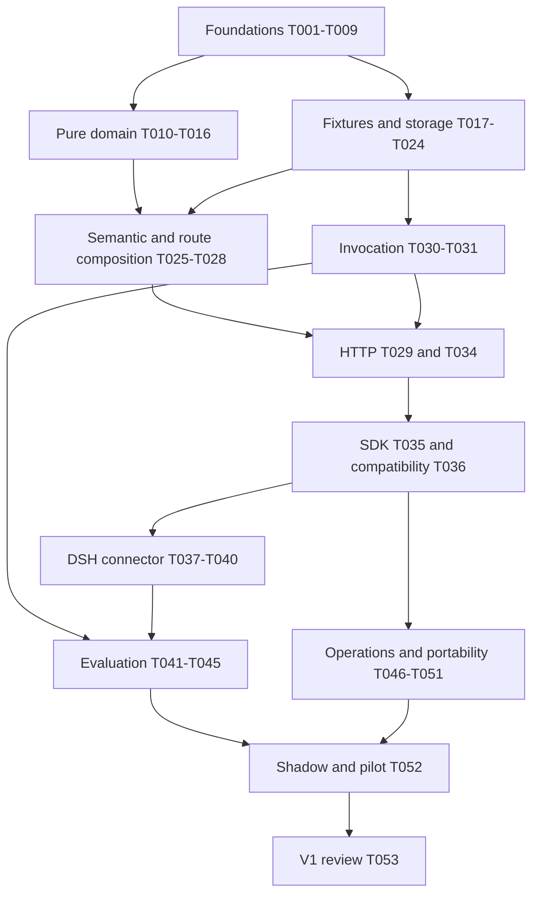

# Heimdall V1 implementation plan

Version 1, 2026-09-22. Status: ready for staged implementation; no Heimdall runtime tasks are complete. Architecture: [system design](system-design.md). Execution record: [brain.md](../brain.md). Product decisions: [decision answers](decision-answers.md). Scope exclusions: [V2 backlog](v2-backlog.md).

## 1. Outcome and execution rules

Build a modular monolith that selects and invokes models, optionally filters caller-authorized tools, and measurably reduces the cost of successful work while satisfying quality and latency requirements. Deliver a separately packageable SDK and an external DeepSeek Harness connector. The harness remains responsible for its agent loop, tools, permissions, and history. The first full vertical slice is a text coding-agent task; chat/RAG and all declared modality requirements remain represented in contracts, with runtime capabilities added only when verified.

The order below is bottom-up. First establish schemas, deterministic domain rules, provider/semantic interfaces, and keyless fixtures. Then build persistence/adapters, compose use cases, add transport and SDK, and integrate the harness. Evaluation and release depend on working behavior. A downstream task may use a dependency's published interface and fixture, but must not secretly implement its unfinished dependency.

### Agent operating procedure

1. Read `brain.md`, `CONTEXT.md`, the relevant design section, and the task card. Check repository instructions for every directory to be edited. The upstream `deepseek-harness/AGENTS.md` applies if an upstream change is genuinely necessary; prefer the external connector.
2. Choose a READY task whose dependencies are DONE. Claim it by updating owner/status in `brain.md` and mark it IN_PROGRESS here. Do not claim several overlapping tasks without concrete independent work and the user's delegation policy.
3. Confirm the dependency's interface and evidence, inspect the current working tree, and use a focused branch/commit or isolated worktree when appropriate. Preserve unrelated edits. Root workspaces must exclude the upstream repository and dependency store.
4. Implement the named deliverable, run its focused checks, and add behavior-focused tests for its real failure modes. No live API keys are needed for core unit/integration tests. No arbitrary broader test runs after relevant checks pass.
5. Record commands, exit status, artifacts, source revision, and material limitations in `brain.md`. Mark the task DONE and check its box only after its acceptance criteria are met. A written proposal, successful compilation alone, or unexecuted test is not completion evidence.
6. If assumptions change, append a change record with previous decision, new decision, evidence/reason, affected task IDs, migration/rework, and owner. Update the current design and affected tasks in the same change. Do not erase prior evidence; mark it superseded.
7. If blocked, record the exact blocker, attempted resolution, and unaffected tasks. Do not bypass an architecture, policy, budget, or evidence invariant to make the checklist green.

### Status vocabulary and completion contract

`TODO` means not started; `READY` is TODO with every prerequisite DONE; `IN_PROGRESS` has a named owner; `BLOCKED` names missing evidence/input; `DONE` has acceptance evidence; `DEFERRED` is explicitly outside the current release. Markdown `[x]` means DONE only. The plan holds the current task status; `brain.md` holds the execution history and current focus. Keep them synchronized. There is no percentage-complete claim inferred from line count.

Each card is one independently reviewable work package with explicit inputs and outputs. If a card cannot fit a focused review, create child IDs such as `T030a` and `T030b`, retain the parent as a milestone, update the DAG, and finish the least dependent child first. Do not renumber existing IDs. A testkit uses public interfaces, not internal mocks. Use contract fixtures to let independent branches proceed without coupling to unfinished adapters.

Global definition of done: the owned public interface is typed/documented; focused success/failure tests pass; no credentials/content leaks; package boundary check passes; affected API/schema versions are updated; migration/backward compatibility is covered where relevant; decisions and verification are recorded; no unrelated upstream changes were introduced. Required commands are created in T001/T002; command names in later cards are proposed script names until then.

## 2. What is already established

- [x] PRE-01 — Product scope and recommendations captured in `CONTEXT.md` and `docs/decision-answers.md`.
- [x] PRE-02 — Prior review retrieved the 109 indexed TypeSafe pages; source snapshots and review are in `docs/research/`.
- [x] PRE-03 — DeepSeek Harness acquired as a shallow Git checkout at `ddefc45`; dependency install and full upstream build passed in the previous setup session. The web server was started then; current uptime is not assumed.
- [x] PRE-04 — DSH integration reconnaissance identifies model/assembly/tool/retry hooks and unresolved connector feasibility checks.
- [x] PRE-05 — Founder approved OpenRouter metadata + official provider documentation + our held-out evaluation data; benchmarks are supporting evidence. A small licensed coding dataset/configurable shortlist is approved as the starting approach.
- [x] PRE-06 — This implementation plan, system design, and execution-memory baseline are authored. Document validation is recorded in `brain.md` after it is run.

These checks do not mean the gateway, SDK, routing algorithm, Jev adapter, or connector exist.

## 3. Dependency map and milestones

The graph is a milestone view; each card's `Depends on` list is authoritative. Number order is not an extra dependency. Tasks at the same ready frontier can proceed independently if they own distinct files and do not change a shared contract. Examples: T009 dataset inventory can proceed alongside domain rules after T002; T021 catalog storage and T022 access storage can proceed after T020; T031 provider transport and T033 outcome intake do not depend on each other. Coordinate shared contract edits before parallel work.

Milestones: M0 contracts/fixtures and DSH feasibility; M1 keyless deterministic route; M2 durable gateway with Jev/OpenRouter adapters; M3 packaged SDK and working DSH task; M4 measured quality/cost/latency evidence; M5 reproducible self-hosting and controlled pilot. Optional caches/online exploration never block the first working slice.

## 4. Foundations: independent units first

### T001 — Workspace, tooling, and module boundaries
- [x] Status: DONE (owner: implementation engineer, 2026-09-22; commit `09c151b`)
**Depends on:** none.
**Owns:** root package/workspace configuration, `apps/gateway/`, `sdk/`, `integrations/`, boundary-check script and CI skeleton.
**Work:** Establish an independent Heimdall Git root if absent; do not change the nested DSH repository. Pin supported Node/pnpm and dependency versions, strict TypeScript/ESM, formatting/linting, test scripts, lockfile install, and root `.gitignore`. Exclude `deepseek-harness/`, `.pnpm-store`, artifacts, secrets, and generated dependencies from workspaces and publication. Encode allowed module imports and SDK isolation. Provide local setup instructions and `.env.example` with names only.
**Acceptance/evidence:** A clean keyless install/typecheck succeeds on the supported runtime; an intentionally forbidden module import is rejected; workspace listing excludes DSH; document actual versions and commands. Do not set up remote publishing or push anything.

### T002 — Contract primitives and error vocabulary
- [x] Status: DONE (owner: implementation engineer, 2026-09-22; commit `3813f65`)
**Depends on:** T001.
**Owns:** `packages/contracts` primitive schemas/types and version policy.
**Work:** Define IDs for request/decision/attempt only; exact money and token units; timestamps; profile enums; modality blocks; typed errors and execution certainty. Generate types/OpenAPI components from one schema source with strict request parsing and explicit extension fields. Decide additive versus breaking-version rules.
**Acceptance/evidence:** Round-trip valid fixtures; reject unknown/malformed/oversized fields, unsafe numbers, invalid currencies, and task-ID fields. Contract generation has a clean diff and deterministic output.

### T003 — Candidate profile and evidence schemas
- [x] Status: DONE (owner: implementation engineer, 2026-09-22; commit `6093164`)
**Depends on:** T002.
**Owns:** catalog domain records and synthetic profile fixtures.
**Work:** Model candidate/config identity, capability unknown/verified/unsupported states, safe context/output capacity, endpoint policy, price schedules, source lineage, uncertainty/sample size, effective dates, and revision snapshots. Define conflict/quarantine rules. Separate declared, measured, and fixture evidence.
**Acceptance/evidence:** Import fixture supports two hosted families and a local endpoint without vendor-specific core types; missing hard capability stays unknown; fixtures cannot be published in production; duplicate IDs and invalid pricing units fail.

### T004 — Effective policy schemas and resolver
- [x] Status: DONE (owner: implementation engineer, 2026-09-22; commit `6093164`)
**Depends on:** T002.
**Owns:** access domain policy resolution.
**Work:** Define platform/tenant/application rules, profile baseline/floor, latency/reliability limits, data egress, allowlists/pins, risk minimums, budgets, and overrides. Implement restrictive intersection and explicit conflict errors. Model classifier egress independently from completion egress.
**Acceptance/evidence:** Lower-level preferences cannot widen hard permissions; a body tenant ID cannot override authenticated identity; strict pin and fallback permission are unambiguous; policy output is immutable/versioned.

### T005 — Canonical request, tools, and continuity data
- [ ] Status: TODO
**Depends on:** T002, T004.
**Owns:** native route request/result schemas and caller routing-state fields.
**Work:** Define messages, application/policy requirements, authorized tool definitions/versions, enabled/disabled selection semantics, reevaluation reasons, remaining task budget, prior candidate, compact objective descriptor, and state revision. Define canonical hashing rules including order where model-visible order matters. Include multimodal requirements while marking first-slice runtime support text-only.
**Acceptance/evidence:** Empty tools and disabled selection are distinct; caller state cannot carry authoritative permissions; no stable task identifier is introduced; explicit model pin and request-only chat/RAG fixtures work.

### T006 — Provider and normalized stream interfaces
- [ ] Status: TODO
**Depends on:** T002, T005.
**Owns:** invocation ports, content events, token accounting and adapter contract fixtures.
**Work:** Define candidate capability resolution, one-attempt invoke, cancellation, actual model identity, usage/finish ordering, replay metadata, and error certainty. Model fragmented tool JSON, first-content commitment, bounded parsing, nonstream aggregation, and unsupported-option errors.
**Acceptance/evidence:** Contract fixtures cover interleaved tool calls, empty finish, late usage, malformed frames, abort, provider error, and tool deltas as commit events. No provider HTTP library enters core types.

### T007 — DeepSeek integration feasibility spike
- [ ] Status: TODO
**Depends on:** T002, T005, T006.
**Owns:** a keyless external plugin spike, profile patch, findings and adapter contract refinement.
**Work:** Against the pinned DSH checkout, prove access to pending input before history commitment; connect preparation to `system-prompt/assemble`, `agent/request`, and `prepareCall`; verify exact route/capabilities/tool definitions in durable logs. Test empty tools, scoped tools, native tool mode, and retry signals. Work out canonical payload binding when model selection affects prompt rendering. Identify how DSH existing model selection and Heimdall ownership compose. Use fake streams, no paid provider.
**Acceptance/evidence:** A recorded fixture demonstrates prepare -> log -> invoke with the intended model/tools; a changed payload invalidates preparation; unsupported PTC/scoped behavior is a documented gate. If public hooks are insufficient, produce the smallest proposed upstream extension and test, without silently editing core internals. The downstream connector API cannot freeze until this result is reviewed in the design log.

### T008 — Semantic engine port and Jev question specification
- [ ] Status: TODO
**Depends on:** T002, T005.
**Owns:** `SemanticDecisionEngine`, rubric registry, state-projector specification.
**Work:** Specify typed continuity/intent/risk/tool-need/action/output judgments and full probability preservation. Define independent batch A and optional dependent tool batch B. Exclude complexity/goal generation. Version rubric, projector, engine/model and limits; document Jev text-only, dual token bounds, Choice/Score constraints, and per-attempt SDK timeout. Put exact comparisons in code.
**Acceptance/evidence:** Each question names its input fields, criteria, unknown path and consumer; dependency diagram proves no within-batch answer dependency; fixture maps typed answers without assuming confidence equals task success. References point to the verified TypeSafe docs in system design section 5.

### T009 — Evaluation data and licensing manifest
- [ ] Status: TODO
**Depends on:** T002.
**Owns:** `evaluation/manifests`, task schema, split registry and judge rubric draft.
**Work:** Inventory a small reproducible mix of bug fixes, tests, bounded refactors, documentation, explanation, tool-heavy and ambiguous-follow-up cases. Identify source repository commits, task licenses, allowed reuse, sandbox needs, success tests, train/tune/test split and contamination risks. Choose representative chat/RAG and modality rejection fixtures. Name dataset candidates after checking sources; do not assert licenses from memory.
**Acceptance/evidence:** Every task has provenance, version, permitted use and executable or rubric-based success criteria. Held-out repository/time partition is sealed before tuning. No private customer data is assumed available.

## 5. Pure domain behavior

### T010 — Deterministic eligibility engine
- [ ] Status: TODO
**Depends on:** T003, T004, T005.
**Owns:** `selection/domain/eligibility`.
**Work:** Evaluate authorization, modalities, context/output reserve, tool and schema support, endpoint policy, known price requirements, freshness, quality/reliability/latency gates. Return typed rejection reasons. Accept exact token estimator input rather than a global tokenizer assumption.
**Acceptance/evidence:** Property tests prove tightening a hard requirement cannot add candidates; unknown hard support never passes; essential tool schema tokens and output reserve count toward context; no eligible candidate produces an explicit result.

### T011 — Cost components and conservative estimator
- [ ] Status: TODO
**Depends on:** T003, T004, T006.
**Owns:** selection cost math and price-unit normalization.
**Work:** Implement exact input/cached/output/reasoning/request/modality costs; explicit expected versus upper-bound estimates; switching and lost-cache cost; bounded retry-sequence expectations with stated probability sources. Unknown values remain unknown. Start with invocation estimates and an estimator interface for later task-level fitting.
**Acceptance/evidence:** Hand-calculated fixtures pass across unit scales and effective-date changes; reasoning is not double-counted; failed-attempt spend is included; missing prices cannot rank as zero; cache hit assumptions never reduce hard-cap reservations without proof.

### T012 — Budget reservation state machine
- [ ] Status: TODO
**Depends on:** T011, T006.
**Owns:** pure budget transitions and ledger invariants.
**Work:** Define estimated/reserved/confirmed/uncertain spend, hard caps versus soft targets, classifier cost inclusion, release/reconcile rules, and aggregate attempt budget. Provider cancellation does not erase possibly charged usage. Strict cap eligibility requires enforceable bounds; reject unsupported exact guarantees.
**Acceptance/evidence:** Property tests prove no admitted attempt exceeds available reserved cap under known bounded charges; retries never reset funds; unknown outcome retains conservative reservation; overrun reporting distinguishes provider uncertainty from arithmetic bugs.

### T013 — Continuity and model-retention rules
- [ ] Status: TODO
**Depends on:** T004, T005, T008.
**Owns:** understanding continuity reducer.
**Work:** Implement first selection, same-task retention, uncertain continuation, explicit reevaluation, clear new task, strict pin, compound request, and mandatory eligibility loss. Keep no-progress reevaluation caller-triggered. Preserve prior candidate across tool-only changes.
**Acceptance/evidence:** A multi-iteration fixture retains one eligible model; new chat/RAG invocation selects anew; uncertainty alone never switches; a revoked or incapable candidate is not retained; stale state revisions cannot overwrite newer connector state.

### T014 — Authorized tool selection and schema budget
- [ ] Status: TODO
**Depends on:** T004, T005, T008.
**Owns:** tool shortlist, relevance interpretation, dependencies, selected definitions.
**Work:** Filter authorization first; use deterministic shortlist rules then injected relevance judgments. Enforce essential tools, declared bundles, token budget and optional count cap. Preserve schema order and version hashes; implement empty selection and additional-tool request handling. Bounded shortlist must fit Jev limits.
**Acceptance/evidence:** Never expose an unauthorized tool; enabled selection can return none; disabled selection preserves explicit authorized tools; required definitions that cannot fit fail visibly; adversarial descriptions cannot grant permissions.

### T015 — Ranking, floors, and fallback order
- [ ] Status: TODO
**Depends on:** T010, T011, T013, T014.
**Owns:** deterministic candidate ranking and reason trace.
**Work:** Apply quality/reliability/latency confidence bounds, choose lowest expected total cost among survivors, honor retention/pins and compound-request rules. Establish stable tie breaks and fallback list with exclusion reasons. Insufficient evidence chooses only a configured eligible baseline or explicit failure.
**Acceptance/evidence:** Fixed inputs and snapshots yield identical ranking; cheaper ineligible models never win; a tie retains the current candidate; fallback candidates meet the same hard requirements; sparse evidence cannot masquerade as proven quality.

### T016 — Bounded model/tool compatibility orchestration
- [ ] Status: TODO
**Depends on:** T015.
**Owns:** pure two-pass selection use case.
**Work:** Compose shortlist/features/selected tools with candidate constraints. Permit one compatibility repair using already evaluated alternatives, recheck exact token fit, then succeed or fail explicitly. Separate domain decisions from any network calls.
**Acceptance/evidence:** Instrumented fixture proves a fixed maximum of two passes, no recursive model/tool loop, and no hidden third semantic stage. Essential tools are not silently dropped to choose a cheaper model.

## 6. Fixtures, persistence, and adapters

### T017 — Deterministic fake provider and stream harness
- [ ] Status: TODO
**Depends on:** T006.
**Owns:** `packages/testkit/provider`.
**Work:** Build scripted text/tool streams, usage, errors, delay, disconnect, cancellation and actual-model mismatch; fake clock and seeded randomness; request recording with redaction. Expose fixture APIs for SDK/DSH tests without importing gateway internals.
**Acceptance/evidence:** Replay produces exact event order; tests can force failure before and after commitment, unknown billed outcome and fragmented tool arguments. Testkit cannot be accidentally selected as production provider.

### T018 — Fake semantic engine and malformed-response fixtures
- [ ] Status: TODO
**Depends on:** T008.
**Owns:** `packages/testkit/semantic`.
**Work:** Return scripted Noul/Choice/Score results, confidence distributions, timeouts and invalid shapes; capture serialized state/rubric versions. Include prompt injection, long irrelevant context, and non-English fixtures without claiming real classifier accuracy.
**Acceptance/evidence:** Deterministic answers support pure domain tests; validation rejects unexpected options, missing question IDs, nonfinite/out-of-range values and oversized responses.

### T019 — Keyless route golden scenarios
- [ ] Status: TODO
**Depends on:** T016, T017, T018.
**Owns:** core scenario suite and expected decision traces.
**Work:** Execute initial/retained/new task, compound work, no tools, essential-tool overflow, no eligible model, strict pin, stale price, increased risk and malformed classifier cases. Assert public decisions, not internal call order except explicit pass/attempt bounds.
**Acceptance/evidence:** All fixtures explain chosen and rejected candidates; tests detect unauthorized selection and missing costs. This is M1's deterministic core proof without database or paid calls.

### T020 — PostgreSQL schema and migration harness
- [ ] Status: TODO
**Depends on:** T003, T004, T006, T012.
**Owns:** owner-labelled migrations, database adapter bootstrap, test database setup.
**Work:** Implement module schemas and indexes for tenant/profile/policy revisions, decisions, claims/attempts/reservations, and outcomes. Define transaction boundaries, constraints, migration ordering, least-privilege roles and unique idempotency keys. No cross-module table access from domain code.
**Acceptance/evidence:** Fresh migration and previous-schema upgrade succeed in disposable PostgreSQL; invalid foreign ownership/duplicate claims fail; rollback strategy is tested through compatible app rollback or backup restore rather than destructive down-migration assumptions.

### T021 — Catalog repository and atomic snapshot publication
- [ ] Status: TODO
**Depends on:** T020, T003.
**Owns:** catalog storage adapter and publication service.
**Work:** Stage revisions, reconcile evidence, atomically publish/rollback snapshots, implement snapshot reads and freshness/quarantine rules. Add leases for concurrent refresh jobs. Load fixture catalog only in development mode.
**Acceptance/evidence:** Readers see one complete revision; failed publish preserves previous active snapshot; concurrent publishers cannot corrupt the active pointer; stale hard fields stop eligibility; rollback reproduces prior metadata.

### T022 — Tenant authentication, policy repository, and secrets
- [ ] Status: TODO
**Depends on:** T020, T004.
**Owns:** access adapters and credential-reference resolution.
**Work:** Implement hashed gateway API keys or deployment identity adapter, tenant resolution, immutable policy publication, admin authorization, rate/concurrency quotas, secret references/environment loading. Support operator-provisioned credentials without deciding the deferred commercial billing model.
**Acceptance/evidence:** Cross-tenant requests/prepared tokens/catalog data fail; secrets never appear in errors or traces; platform denies survive all overrides; classifier egress is checked. Quota reservations are safe under concurrency.

### T023 — Durable invocation claims and budget ledger
- [ ] Status: TODO
**Depends on:** T020, T012, T006.
**Owns:** invocation repository, idempotency leases, usage reconciliation.
**Work:** Persist pre-dispatch intent, unique claims and reservations; handle same-key/same-payload retries, conflicts, concurrent requests, expired leases, crashes and possibly-started outcomes. Separate result metadata from opt-in transient content replay.
**Acceptance/evidence:** Two concurrent requests dispatch at most one provider attempt; database crash windows yield explicit uncertainty instead of silent duplicate billing; unknown spend is retained; opt-out content is not stored. No exactly-once claim exceeds the evidence.

### T024 — Catalog and feature caches
- [ ] Status: TODO
**Depends on:** T021, T005, T018.
**Owns:** bounded process caches behind interfaces.
**Work:** Implement byte/entry limits, versioned keys, field-specific expiry, single-flight coalescing, tenant isolation and invalidation. Catalog read-through cache and successful feature cache are separate. A cancelled waiter must not abort work still needed by another authorized waiter.
**Acceptance/evidence:** Version/policy/permission changes invalidate relevant reuse; no negative/no-route/provider-error entry is cached; concurrent identical requests share safe work; memory remains bounded; coarse context buckets never skip exact eligibility checks.

### T025 — Real Jev adapter
- [ ] Status: TODO
**Depends on:** T008, T018.
**Owns:** `understanding/adapters/jev` only.
**Work:** Pin SDK/model, implement `systemOne`, validate answers, record actual model/usage, enforce both context bounds, serialize compact textual state, and translate errors. Propagate total deadline/cancellation; explicitly configure retries to avoid layered retry amplification. Redact raw content from telemetry.
**Acceptance/evidence:** Fake HTTP transport checks exact payload and abort/retry behavior; production core imports no TypeSafe types; SDK timeout cannot outlive total deadline. A small credentialed smoke is optional evidence and must report actual cost, not block keyless correctness.

### T026 — Request-understanding service
- [ ] Status: TODO
**Depends on:** T025, T024, T013.
**Owns:** state projector, feature lookup, semantic stage scheduling and degradation.
**Work:** Combine deterministic modalities/context facts and caller declarations with Jev features. Fetch only relevant state, batch independent questions, defer tool shortlist-dependent batch, preserve uncertainty, and return an eligible safe-default path on classifier failure. No summarization generation, goal stage, or complexity estimator.
**Acceptance/evidence:** Counters prove stage bounds; exact cache hits skip Jev; changed relevant input misses; classifier failure never relaxes hard policy; nontext content is not sent as binary to Jev; declared risk is not lowered.

## 7. Compose the gateway

### T027 — Route preparation use case
- [ ] Status: TODO
**Depends on:** T016, T026, T021, T022, T019.
**Owns:** routing application service and decision trace.
**Work:** Authenticate context, capture snapshots, assemble features/tools, apply retention and ranking, return full route metadata and compact caller state. Keep dependencies immutable during decision evaluation. Explain every fallback/degradation and differentiate baseline fallback from violating a floor.
**Acceptance/evidence:** End-to-end keyless route requests reproduce golden scenarios through real module interfaces; fixed snapshots reproduce decisions; no network/database work occurs inside pure ranking code.

### T028 — Prepared-route tokens and finalization
- [ ] Status: TODO
**Depends on:** T027, T023, T007.
**Owns:** route token signing, payload binding, expiry and invocation revalidation.
**Work:** Implement tenant-bound request/config/tool digests and short-lived prepared token; finalize DSH's post-selection prompt through the proven mapping. Verify current hard policy at invocation and reject stale/replayed/modified preparations. Persist only minimal metadata.
**Acceptance/evidence:** Changed tenant/tool schema/message/config/expiry fails; allowed finalized prompt transformation succeeds only through its explicit rule; token contains no raw messages or credentials; no task ID or managed task ledger is introduced.

### T029 — Native route HTTP API
- [ ] Status: TODO
**Depends on:** T028, T022.
**Owns:** Fastify route-only/tool-selection/catalog/admin HTTP adapters.
**Work:** Apply schema validation, request size/deadline limits, authentication, error translation, request IDs and OpenAPI. Expose catalog/policy admin operations with distinct permissions. Dry run must not invoke a completion provider.
**Acceptance/evidence:** HTTP injection tests prove status/error schemas, tenant isolation, malformed request rejection and route-only behavior; generated OpenAPI matches actual endpoints; no business selection logic exists in handlers.

### T030 — Invocation and sequential recovery coordinator
- [ ] Status: TODO
**Depends on:** T023, T006, T017, T011, T012, T010.
**Owns:** provider-neutral attempt state machine.
**Work:** Revalidate exact payload fit/current hard policy, reserve spend, dispatch one attempt, normalize events, enforce commitment, cancellation/backpressure and deadline. Bound same-model retry then next-ranked fallback. Provide internal and caller-coordinated recovery modes using the same budget/recovery state. Strict pins cannot silently switch.
**Acceptance/evidence:** Fake streams verify pre-content fallback, no post-content splice, raw tool JSON fragments, single terminal event, late usage reconciliation, uncertain dispatch and abort. Maximum attempts and total deadline hold across every retry layer.

### T031 — OpenRouter adapter and endpoint control
- [ ] Status: TODO
**Depends on:** T030, T006.
**Owns:** OpenRouter transport and protocol mappings.
**Work:** Invoke explicit selected models, constrain provider endpoints when needed, disable hidden model fallback and server-side tool execution, normalize structured output/tool calls/errors/usage and record actual model/provider. Preserve supported replay information and explicitly reject unsupported fields. Do not leak secrets through returned upstream errors.
**Acceptance/evidence:** Recorded/fake HTTP streams pass the provider conformance suite; mismatch in actual model becomes a protocol/policy failure, not a silently relabelled response; malformed/empty/interrupted streams are handled. A budgeted live test is isolated from routine CI.

### T032 — Real profile ingestion and candidate shortlist
- [ ] Status: TODO
**Depends on:** T021, T009, T003.
**Owns:** source adapters, data manifests, first candidate/evidence set.
**Work:** Fetch OpenRouter metadata/prices; reference official provider capability sources; map units/configs and stage conflicts; choose the initial hosted families/local endpoint. Attach licenses and source versions. Produce real profiles with unknown quality until evaluated; never fill gaps with fabricated scores.
**Acceptance/evidence:** Source changes produce a reviewable diff and immutable revision; every hard field has evidence or remains unknown; actual candidate list and reasons are recorded; dry-run import works without changing production active catalog.

### T033 — Outcome feedback and aggregate evidence
- [ ] Status: TODO
**Depends on:** T023, T009, T029.
**Owns:** feedback endpoint/application/storage and versioned aggregate jobs.
**Work:** Accept caller-reported tests, typecheck/lint, accepted patches, corrections, completion and failure attribution. Link by decision/attempt IDs; deduplicate events; preserve delayed outcome and consent state. Aggregate offline quality/cost summaries through reviewed catalog publication, never auto-promote raw production feedback.
**Acceptance/evidence:** Duplicate/late/conflicting feedback is deterministic and attributable; tenant isolation and training opt-in hold; missing outcomes are not counted as successes; report clearly distinguishes reported and verified evaluation evidence.

### T034 — Invocation HTTP, SSE, and cancellation
- [ ] Status: TODO
**Depends on:** T029, T030.
**Owns:** native invocation API and transport lifecycle.
**Work:** Compose combined route/invoke and prepared invocation endpoints with schema validation and idempotency. Map normalized event IDs, status, errors, usage and terminal events to SSE. Handle disconnect, bounded buffers, slow readers, total deadline and nonstream aggregation.
**Acceptance/evidence:** Black-box client tests verify abort propagation, fragmentation/backpressure, no duplicate provider call on retried key, no streamed fallback after commitment, and correct error before/after HTTP headers. Use fake provider first.

### T035 — TypeScript SDK in its own folder
- [ ] Status: TODO
**Depends on:** T034, T029, T006, T033.
**Owns:** `sdk/typescript`, package exports and examples.
**Work:** Implement typed route/invoke/tool/outcome/catalog methods, async stream iterator, cancellation, deadline and typed errors. Expose prepared-route flow and caller state. Default paid invocation retries off unless same-key server semantics guarantee safe recovery; make read-only retries bounded. Inject fetch for testing; import contracts only.
**Acceptance/evidence:** Packed SDK installs in a clean external project, type inference/ESM exports work, stream cancellation reaches fake provider, no server dependencies or secrets ship, and chat/RAG/coding examples execute keylessly.

### T036 — OpenAI-compatible adapters
- [ ] Status: TODO
**Depends on:** T034, T035.
**Owns:** Responses-style compatibility first; Chat Completions mapping second.
**Work:** Publish supported-field/event matrix; translate roles/content/tools/usage/finish/errors through native use cases. Configure profile and advanced routing metadata explicitly. Unsupported stateful provider behavior or parameters fail clearly; no silent field dropping.
**Acceptance/evidence:** Official-client-shaped fixtures and a clean client project pass supported examples; cancellation/tool streaming/native outcome equivalence holds; documentation explicitly lists limitations. Compatibility does not bypass authentication or hard eligibility.

## 8. DeepSeek Harness connector

### T037 — External DSH model connector
- [ ] Status: TODO
**Depends on:** T007, T028, T035, T031.
**Owns:** `integrations/deepseek-harness` provider plugin and versioned profile patch.
**Work:** Implement prepare-before-log model routing and a provider adapter that invokes the prepared candidate through the SDK. Return actual candidate capabilities, preserve reasoning/defaults/replay rules, store caller routing state locally with revision checks. Respect explicit DSH model pin and do not select on every iteration.
**Acceptance/evidence:** Pinned DSH package/checkout can run keylessly through the public adapter API; actual selected model matches request context and assistant metadata; resumed and continuing tasks retain the intended model; no private loop imports.

### T038 — DSH selected-tool assembly and permissions
- [ ] Status: TODO
**Depends on:** T037, T014.
**Owns:** connector tool projection and assembly integration.
**Work:** Supply only DSH-authorized tool definitions to Heimdall, apply selected definitions before log freeze, and keep descriptions/instructions consistent with visibility. Preserve DSH execution validation and scoped restrictions. Implement native tool mode first; test and explicitly gate PTC/scoped exceptions rather than assert support.
**Acceptance/evidence:** Durable request reconstructs the exact model-visible tool set; empty/enabled/disabled modes work; generated unselected tool names never bypass DSH guards; reselection does not cause a model switch by itself.

### T039 — DSH retries, fallback attribution, and budgets
- [ ] Status: TODO
**Depends on:** T038, T030.
**Owns:** connector recovery coordination.
**Work:** Integrate next-ranked fallback with `agent/request-error` and the established preparation flow. Ensure DSH logs each actual candidate before invocation, shares one invocation budget/attempt sequence, and does not multiply gateway/provider/SDK retries. Propagate interrupted prefix and cancellation faithfully.
**Acceptance/evidence:** A fake pre-content failure triggers one logged next-eligible attempt; a post-content failure never restarts the answer transparently; retry accounting totals all attempts; tool calls cannot execute twice from duplicated stream recovery.

### T040 — DSH end-to-end acceptance suite
- [ ] Status: TODO
**Depends on:** T039, T033.
**Owns:** bounded fixture workspace, recorded sessions and integration runbook.
**Work:** Run a real DSH coding loop with fake model responses that reads/edits a fixture, runs a small test, and completes. Add new-task, continuation, explicit reevaluation, tool omission, context growth, no eligible model and resume cases. Use repo-supported launcher/profile and snapshot policy.
**Acceptance/evidence:** Task outcome, tool effects, durable route/tool log and Heimdall trace agree. Run on Windows and a Linux CI fixture. This proves the connector, not quality improvement; paid coding comparisons belong to evaluation tasks.

## 9. Evaluation, performance, portability, and release

### T041 — Reproducible offline evaluation runner
- [ ] Status: TODO
**Depends on:** T009, T033, T035, T032, T031.
**Owns:** evaluation CLI, budgets, task runners and baseline reports.
**Work:** Run fixed tasks/candidate configurations, isolate workspaces, freeze dataset versions, collect all attempts/spend/latency and caller success checks. Compare strongest, cheapest eligible, static rules and baseline. Enforce run-level spend/concurrency ceilings and stop controls; paid execution remains explicit.
**Acceptance/evidence:** Keyless replay reproduces report outputs; failed spend and abandoned tasks remain visible; no train/test leakage; report identifies model aliases/version uncertainty and judge configuration. Record credentials needed without reading or printing them.

### T042 — Jev calibration and G7 batching review
- [ ] Status: TODO
**Depends on:** T041, T025, T026.
**Owns:** classifier calibration report and versioned thresholds.
**Work:** Evaluate continuity/intent/tool-need/action/output features, uncertainty paths and language slices. Compare batched questions against a sequential baseline only where inputs are equivalent; test dependent stages separately. Measure actual routing overhead/tokens rather than importing vendor performance claims. Resolve G7's starred dependency/concurrency review.
**Acceptance/evidence:** Held-out confusion/calibration metrics and latency distributions support each enabled threshold; unknown/low-confidence paths are tested; rubric/model changes invalidate prior calibration and feature-cache versions.

### T043 — Tool-selection and two-pass ablations
- [ ] Status: TODO
**Depends on:** T041, T038, T016.
**Owns:** tool recall/quality/latency report and shortlist settings.
**Work:** Compare full authorized catalog, deterministic filtering, semantic filtering and two-pass compatibility. Measure essential-tool recall, successful task cost, schema tokens, recovery requests and added latency. Test tool descriptions as adversarial input and large catalogs.
**Acceptance/evidence:** Thresholds/shortlist limits come from task outcomes; poor-recall subsets cannot pass solely on token savings; complexity is absent from feature ablations; removal of a feature is recorded with reasons.

### T044 — Calibrated task-cost estimator
- [ ] Status: TODO
**Depends on:** T041, T011, T033.
**Owns:** measured probability/cost model, versioned estimator artifact and fallback rules.
**Work:** Fit transparent task-conditioned estimates from observed full-task traces and failed attempts. Separate expected remaining cost from admission upper bound and actual bill. Measure calibration and error by model/task family; define sparse-data fallback. Include cache-switch loss and classifier overhead.
**Acceptance/evidence:** Held-out estimates beat or justify the simple conservative estimator; no target leakage; units and double-counting checks pass; unsupported families remain baseline-only rather than invented estimates.

### T045 — Quality floor and launch-metric specification
- [ ] Status: TODO
**Depends on:** T042, T043, T044, T040.
**Owns:** profile baseline, tolerated regression, confidence/sample-size plan and release gate configuration.
**Work:** Set exact non-inferiority margin, cost-reduction target, latency/reliability/tool-recall/no-route limits and interval method using product priorities and measured data. Pre-register final held-out run and stopping rule before inspecting its result. Keep statistical uncertainty explicit.
**Acceptance/evidence:** A checked-in gate file has no unset required value; the final report can pass/fail every gate mechanically; strongest/static baseline comparisons and cost per successful task are reproducible. Failure or insufficient power blocks production claims, not core development.

### T046 — Load, backpressure, and cache benchmarks
- [ ] Status: TODO
**Depends on:** T045, T034, T024.
**Owns:** repeatable benchmark scenarios and SLO proposals.
**Work:** Measure cold/warm routes, pinned path, Jev miss/hit, large tools, long context, burst traffic, slow clients and multi-replica duplication. Attribute local overhead, queue time, classifier and completion latency separately. Validate memory bounds and deadline behavior.
**Acceptance/evidence:** p50/p95/p99 and resource profiles include test environment/versions; test cannot hide failures by dropping samples; cache benefit does not introduce stale authorization; optimize only measured bottlenecks and record any tradeoff.

### T047 — Second hosted family and local endpoint portability
- [ ] Status: TODO
**Depends on:** T031, T006, T032.
**Owns:** necessary direct/local adapters and portability conformance fixtures.
**Work:** Verify at least two hosted families through the selected provider path and one configured local/open endpoint. Add a native adapter only for a real gap; preserve unsupported capability errors. Document which billing/quality/region guarantees each endpoint can meet.
**Acceptance/evidence:** Shared adapter suite passes; canonical conversation/tool streams survive supported provider switches; untranslatable native replay state fails explicitly; unsupported modalities do not become eligible merely because a gateway schema accepts them.

### T048 — Python SDK parity
- [ ] Status: TODO
**Depends on:** T035, T034.
**Owns:** `sdk/python`, package metadata and parity fixtures.
**Work:** Implement sync/async request methods as appropriate, streaming, cancellation/deadline semantics, typed errors, prepared-route workflow and state transport. Reuse language-neutral contract fixtures; no server implementation reuse.
**Acceptance/evidence:** Packaged client installs in a fresh environment and passes native protocol fixtures; TypeScript/Python event and error semantics agree; examples avoid credentials in code. TypeScript remains the first implementation dependency for DSH.

### T049 — Deployment, maintenance, and telemetry
- [ ] Status: TODO
**Depends on:** T020, T034, T035.
**Owns:** `infra`, image/compose, migrations command, health, metrics and runbooks.
**Work:** Build one nonroot gateway image, PostgreSQL compose, startup validation, graceful shutdown, catalog maintenance leases and redacted telemetry. Document ports, configuration, readiness, secret injection, backup/restore and rollout/rollback. Define retention values in deployment config before hosted use.
**Acceptance/evidence:** Clean machine/container startup serves a keyless example; missing required config fails clearly; SIGTERM drains or records cancellation; backup restores usable catalog/ledger; root artifact excludes upstream DSH and development fixtures where inappropriate.

### T050 — Security and failure-recovery verification
- [ ] Status: TODO
**Depends on:** T049, T034, T036, T028.
**Owns:** threat-focused integration suite and operational recovery drills.
**Work:** Test tenant isolation, token replay/tamper, malicious schemas/prompts/tool descriptions, credential redaction, classifier egress denial, provider endpoint injection, parser bounds, database outage, stale catalog, process crash and shutdown. Validate safe degraded mode without negative caching or hidden permission relaxation.
**Acceptance/evidence:** Each threat maps to a concrete assertion; no bypass of hard controls in fallback; uncertain paid execution survives restart; quotas/budgets remain correct across replicas. Findings are fixed or explicitly block release.

### T051 — Distribution and documentation readiness
- [ ] Status: TODO
**Depends on:** T035, T036, T049.
**Owns:** package release configuration, adoption docs, licenses/SBOM and self-host guide.
**Work:** Validate SDK tarballs/wheels, gateway image and connector package independently. Document compatibility limits, data handling, error recovery, native/compatibility migration, seed-data licenses and attribution. Ask for an explicit project license decision before public distribution; commercial pricing remains deferred.
**Acceptance/evidence:** Rehearsed install from built artifacts succeeds; no secret/local-path dependency leaks; supported version matrix is explicit; license and data rights are resolved before publication. Do not publish as part of this planning task or without release authorization.

### T052 — Shadow, canary, and rollback experiment
- [ ] Status: TODO
**Depends on:** T045, T046, T047, T050, T051, T040.
**Owns:** pilot configuration, experiment results and rollback evidence.
**Work:** First run recommendations without controlling production routing; then a tenant-authorized small canary using fixed gates/budgets. Compare paired outcomes where feasible, watch regressions and missing evidence, rehearse disable/pin/snapshot rollback. No exploration unless T055's separate starred review passes.
**Acceptance/evidence:** Every gate is evaluated with uncertainty; failing gates stop expansion; no-route and fallback costs are counted; rollback demonstrably restores the known baseline; candidate/config/evidence versions are retained.

### T053 — V1 completion and handoff
- [ ] Status: TODO
**Depends on:** T052, T048.
**Owns:** release evidence index, final checklist and operator/developer handoff.
**Work:** Review scope versus decisions, verify all mandatory tasks and relevant tests, record known limitations, and link artifacts/runbooks. Reconcile `brain.md` and checkboxes with actual commands/commits. Confirm tool execution, planner behavior, task IDs and hedging were not inadvertently introduced.
**Acceptance/evidence:** V1 can be installed, tested, operated and rolled back by another developer; claims match measurements; SDK and connector versions are explicit. Mark complete only after the evidence exists.

## 10. Optional later V1 work and preserved deferrals

### T054 — Tool/final-decision cache and semantic-prior experiment
- [ ] Status: TODO (optional; not on the first release critical path)
**Depends on:** T045, T024, T027.
**Owns:** optional cache layers and measured reuse experiment.
**Work:** Add tool-selection/final-decision exact caches only after correctness cases pass. Compare semantic priors against exact reuse; enforce all versioned keys and fresh eligibility. Do not cache provider responses or failures.
**Acceptance/evidence:** Measurable net latency/cost benefit with no quality or authorization regression; feature can be disabled independently; low benefit means leave it disabled and record the result, not force implementation.

### T055 — F11 exploration policy review and optional experiment
- [ ] Status: TODO (starred; disabled by default)
**Depends on:** T045, T050.
**Owns:** documented opt-in/traffic/stop/promotion policy and optional low-risk experiment.
**Work:** Revisit the founder's explicit asterisk. Define authorized tenants, eligible low-risk tasks, spend/traffic caps, stop conditions, offline comparison and reviewed promotion. Do not allow high-risk or unverified hard-capability exploration.
**Acceptance/evidence:** Explicit feature decision and policy are recorded before activation; reproducible offline evidence supports the experiment; production default remains off. This task is not a justification to delay the keyless build.

Formal task IDs and compound-task decomposition/rerouting remain V2. Goal definition, complexity, parallel hedging (J7–J11), provider-response/negative caching and commercial planning remain outside the current build. G7 is resolved through T042 evidence; it is not permission to run dependent questions concurrently.

## 11. Traceability and change control

| Requirement | Main tasks | Proof |
| --- | --- | --- |
| Modular monolith; separate SDK | T001, T002, T035, T048, T049 | Boundaries, packed consumers, one image |
| Quality before cost | T010, T015, T041–T045 | Hard-gate cases, held-out non-inferiority |
| Jev replaceable and bounded | T008, T018, T025, T026, T042 | Fake/real adapter contract, stage bounds |
| Retain coding-task model | T013, T027, T037, T040 | Multi-iteration and resume fixtures |
| Optional filtered tools; no execution | T014, T016, T038, T040 | Exact logged definitions and caller tool effects |
| OpenRouter normalization and ranked fallback | T006, T030, T031, T039 | Protocol/attempt/stream tests |
| Report-card/features caches first | T024, T054 | Versioned isolation and no-negative-cache tests |
| Hard/soft budgets and honest usage | T011, T012, T023, T044 | Arithmetic/concurrency/crash evidence |
| Chat/RAG and compatibility | T005, T034–T036, T048 | Packaged examples and conformance matrix |
| Hosted/self-hostable | T020, T022, T049–T053 | Restore, migration, deployment and pilot evidence |
| Agent-readable completed work and changes | Every task | Synchronized task state and `brain.md` ledger |

An implementation discovery can change an engineering choice without reopening every product decision. Record the difference and reason before propagating it. Changes to scope, safety guarantees, paid spend, licensed data usage, public distribution, or caller-visible behavior require explicit evidence and the appropriate user decision; routine internal details follow this accepted plan.

At each milestone, update the plan's current status and `brain.md`: what passed, what failed, what remains uncertain, and the next READY IDs. Never replace a failed result with a later success without retaining the failure and fix history. This plan is complete as a planning artifact; the unchecked tasks intentionally describe future work.
