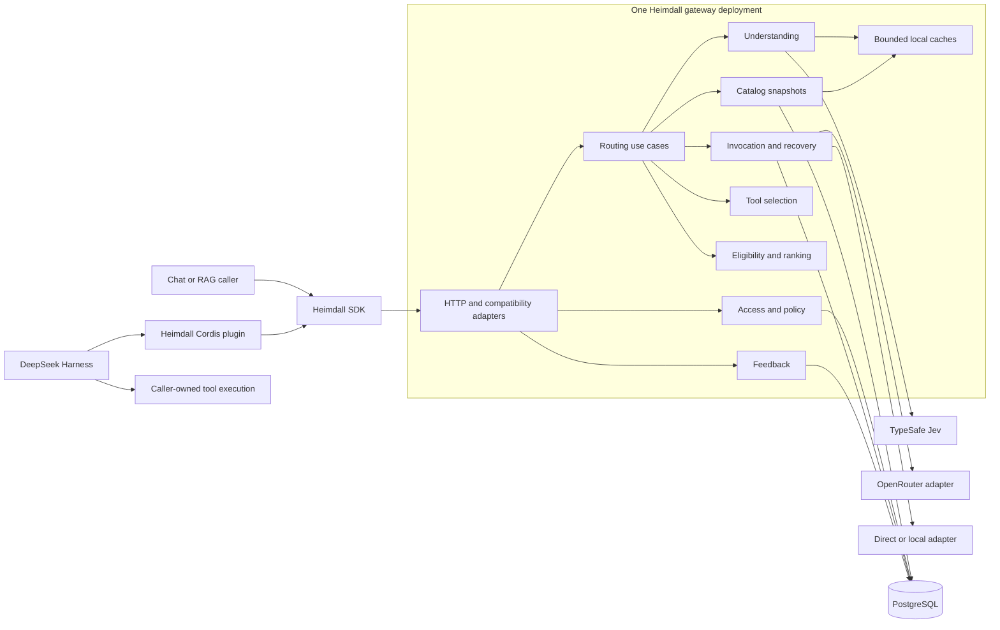
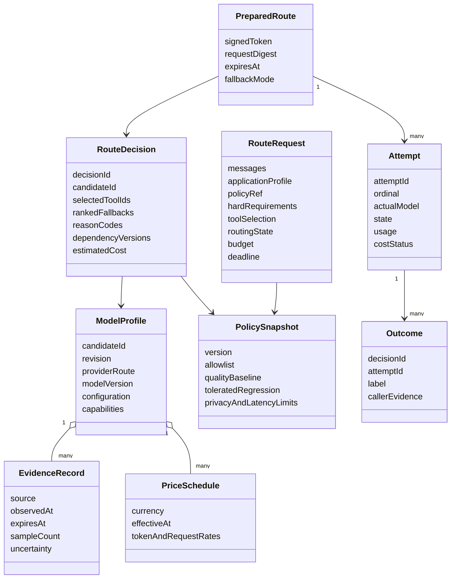
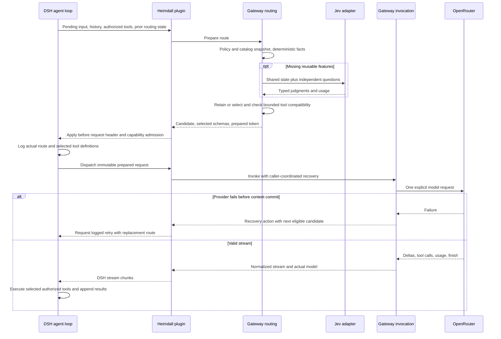
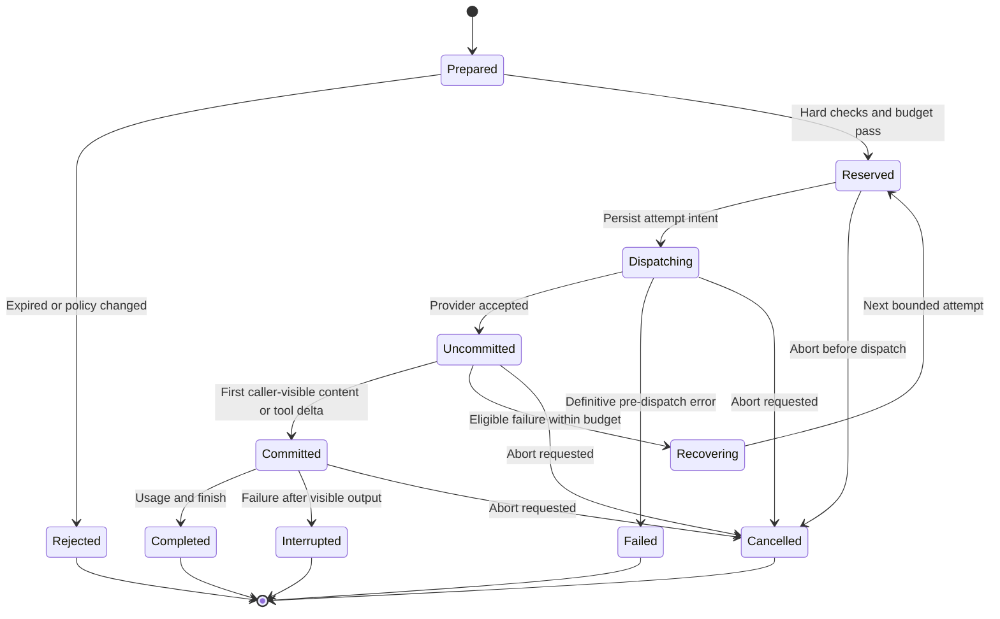
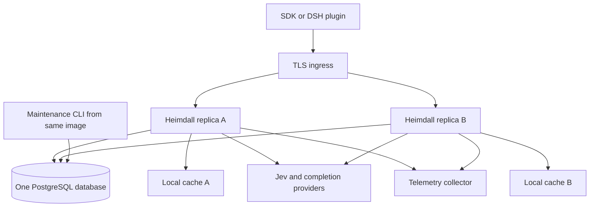

# Heimdall V1 system design

Status: implementation design baseline, not implemented. Updated: 2026-09-22. Read with [implementation plan](implementation-plan.md), [decision answers](decision-answers.md), [domain context](../CONTEXT.md), and [execution memory](../brain.md). The task IDs below refer to the implementation plan.

## 1. Purpose and measurable objective

Heimdall is a hosted and self-hostable model gateway. It chooses an eligible model, invokes it, and optionally selects the caller-authorized tools whose definitions the model receives. The caller executes tools and owns the agent loop, prompts, conversation memory, and output verification. The first controlled workload is the DeepSeek Harness coding agent; chat and RAG requests share the same gateway.

Quality and capability are prerequisites. Among candidates meeting the profile's hard quality, privacy, reliability, capability, and latency requirements, select the lowest expected total cost. Coding agents retain their selected model across a continuing task. A new task or explicit caller reevaluation can cause selection; uncertainty alone retains the current eligible model. Tool selection can change on an iteration without changing the model. A compound request uses one most-capable eligible model for all parts, using workload-conditioned evidence rather than a global intelligence score.

Success means bounded quality non-inferiority versus a declared baseline, lower cost per successful coding task, acceptable tail latency, and correct tool visibility. Numerical thresholds are calibrated in an evaluation milestone before production rollout. Fast routing is a measured objective, not an assumed property of Jev or a cache.

### Scope constraints

- Included: route-only and route-and-invoke APIs; optional tool filtering; versioned model profiles; Jev-based request features; hard eligibility; cost ranking; retention; sequential retry/fallback; normalized streaming; SDK; DSH connector; auditable outcomes; evaluation and minimal operations.
- Excluded from V1: formal task IDs, compound-task decomposition, goal-definition stage, complexity prediction, parallel hedging, provider-response and negative caches, tool execution, planning, workflow orchestration, prompt management, provider marketplace, and a general observability product.
- F11 exploration and G7 concurrency remain starred. The first build has exploration off; batching uses only demonstrably independent questions. Their acceptance tests precede activation.
- Commercial design remains deferred. Hosted publication, license choice, and paid evaluation credentials are separate release tasks.

## 2. Architecture and technology choices

Use a modular monolith: one Node.js application image and one composition root. Modules communicate through typed in-process interfaces. A PostgreSQL database provides durable records with module-owned schemas. Bounded process-local caches are the first cache implementation. No service mesh, message broker, vector database, Redis dependency, or independently deployed module is required for V1. Maintenance and evaluation commands reuse the same application modules; the offline evaluator is a CLI, not another production service.

Planning defaults: TypeScript in strict ESM mode, Node 24 LTS-compatible runtime, pnpm workspace with frozen lockfile, Fastify HTTP adapter, JSON Schema/OpenAPI contracts compiled with Ajv, PostgreSQL through a parameterized query adapter, Vitest for tests, and structured logs/OpenTelemetry-compatible spans. Select and pin exact dependency versions during T001; these choices are replaceable at adapters. Fastify supports request validation and response serialization from schemas; keep externally supplied tool schemas out of framework schema compilation unless separately bounded and validated. [Fastify validation documentation](https://fastify.dev/docs/latest/Reference/Validation-and-Serialization/). PostgreSQL schemas organize module-owned tables but do not by themselves enforce application ownership. [PostgreSQL schemas](https://www.postgresql.org/docs/current/ddl-schemas.html).

### Repository layout

```text
Heimdall/
  brain.md                        # verified progress and change history
  CONTEXT.md                      # domain language only
  package.json                    # root workspace, scripts, pinned tooling
  pnpm-workspace.yaml             # explicit globs, excludes upstream checkout
  packages/
    contracts/                    # wire schemas, DTO types, OpenAPI, error codes
    testkit/                      # fake providers, clocks, fixtures; no production imports
  apps/
    gateway/
      src/main.ts                 # sole production composition root
      src/http/                   # auth, native/compatibility routes, SSE mapping
      src/modules/
        access/                   # tenant identity, policy resolution, quotas
        catalog/                  # model/config profiles, evidence, snapshots
        understanding/            # state projection, Jev, feature cache, continuity
        tool-selection/           # authorized tool shortlist, schema budget
        selection/                # eligibility, cost estimates, deterministic ranking
        routing/                  # use-case orchestration, signed prepared routes
        invocation/               # attempts, adapters, streams, retry/fallback
        feedback/                 # outcome intake and offline evidence aggregation
      src/platform/               # config, clocks, telemetry, database composition
      migrations/                 # ordered migrations labelled with owner module
  sdk/
    typescript/                   # separately packageable SDK; no server imports
    python/                       # later V1 portability client, same wire fixtures
    examples/                     # chat, RAG, coding retention, filtered tools
  integrations/
    deepseek-harness/             # external Cordis plugin, profile patch, contract tests
  evaluation/
    manifests/ fixtures/ rubrics/ runners/ reports/
  data/
    catalog/                      # licensed seed manifests; fixtures clearly synthetic
  infra/                          # Dockerfile, compose, deployment/runbook configuration
  scripts/                        # contract generation, boundaries, docs validation
  docs/
    system-design.md
    implementation-plan.md
    decision-answers.md
    research/
  deepseek-harness/                # upstream reference checkout; not a root workspace
```

Every module exposes `public.ts`; internals use `domain/`, `application/`, and `adapters/` when those distinctions help. Do not mechanically create empty layers. DTOs crossing HTTP live in `packages/contracts`; internal domain types stay with their owner. The SDK imports contracts, never server implementation. The DSH plugin imports the SDK plus supported DSH packages, never private agent-loop files. Exclude the upstream checkout, generated output, `.pnpm-store`, and installed dependencies from root compilation, formatting, and package publication. Decide how the upstream reference is reproducibly acquired during T001; never accidentally stage its entire source into the Heimdall repository.

### Component view

The component view uses Mermaid flow notation; the following class, sequence, and state views use UML concepts expressed in Mermaid.



### Module ownership and dependency rules

| Owner | Owns | Public operations | Permitted dependencies |
| --- | --- | --- | --- |
| Access | Tenant identity, credential references, policy versions, quotas | resolvePolicy, authorize, reserveQuota | Contracts, platform |
| Catalog | Candidate profiles, observations, effective price records, published snapshots | snapshot, resolveCandidate, publish | Contracts, platform |
| Understanding | Compact state, typed semantic questions, feature results, continuity rules | understand, evaluateContinuity | Contracts, SemanticDecisionEngine port |
| Tool selection | Authorized catalog projection, shortlist, relevance, definition token budget | selectTools, validateSelectedSet | Contracts, semantic port and token estimator port |
| Selection | Hard eligibility, conservative cost/quality estimates, ranking | filter, estimate, rank, retainOrSelect | Read-only policy/catalog/features DTOs; no HTTP/DB |
| Routing | Route preparation, bounded composition, continuity envelope | prepareRoute, routeAndInvoke | Public APIs of access, catalog, understanding, tools, selection, invocation |
| Invocation | Attempt state, budget reservations, provider translation, recovery | invokePrepared, cancel, reconcileUsage | Contracts, provider port, catalog/policy read interfaces |
| Feedback | Outcomes, deduplication, evidence summaries | recordOutcome, aggregate | Contracts, own storage; catalog update via public publication API |

Invocation receives ranked candidates and rejection reasons; it does not call routing recursively. Semantic adapters do not choose authority or permissions. HTTP handlers translate DTOs and call use cases; they contain no ranking logic. No module queries another module's tables. A public read interface or immutable snapshot crosses that boundary. Enforce these rules with import-boundary tests and architecture linting from the first scaffold.

## 3. Domain model and contracts



### Input and output shape

Use a required application profile (`coding-agent`, `chat`, or `rag`) and policy reference; resolve policy from authenticated tenant context, never trust a body tenant ID. The contract accepts a canonical message list and structured content blocks. Text, image, audio, video, file/document, and mixed requirements are expressible. The first executable slice supports text; adapters advertise tested modalities and reject unsupported content explicitly. Schema support is not a claim of runtime support for every modality.

Optional fields: caller risk/importance declarations; model pin/allowlist/preferences; output schema; context requirements; authorized tool definitions; tool selection enabled flag; prior routing state; reevaluation reason; remaining task budget; total request deadline; provider-specific extension object with explicitly supported keys. Unknown extensions are rejected rather than silently lost.

Tool selection disabled means Heimdall does not choose a subset: explicitly supplied authorized tools pass through subject to capability/schema validation; omitted tools remain absent. Enabled means only selected definitions reach the model. Empty selection is valid. Selection does not grant execution permission. Tool arguments come from the chosen model and are validated/executed by the caller.

Response metadata includes decision/request/attempt IDs, selected and actual provider/model, candidate/config versions, tool IDs and versions, retention reason, fallback history, policy/catalog/classifier versions, estimated and observed usage/cost, finish reason, and compact routing state. Full evidence is available only in authorized debug views. A decision ID identifies one routing decision, not a task.

Money uses exact decimal strings or fixed-point integers with declared currency and scale; never binary floats for billing arithmetic. Counts and timestamps use validated bounded values. Use `unknown` plus schema validation at external boundaries, discriminated unions for states, and immutable snapshots for decisions.

### Public endpoints and error surface

| Endpoint | Purpose | Important behavior |
| --- | --- | --- |
| `POST /v1/routes` | Prepare/dry-run a route | Returns ranked decision and optional expiring prepared token; never invokes completion model |
| `POST /v1/invocations` | Invoke a prepared route or perform combined routing | Structured JSON or normalized SSE; idempotency applies |
| `POST /v1/tools/select` | Optional independent tool-selection use case | Caller-authorized catalog only; no execution |
| `POST /v1/outcomes` | Caller-reported evidence | Idempotent; references decision/attempt; accepted is not verified success |
| `GET /v1/models` | Authorized profiles/capabilities | Tenant-filtered projection, revision metadata |
| `/v1/admin/catalog/*`, `/v1/admin/policies/*` | Restricted publish/rollback | Authenticated administrative role, validation, audit |
| `GET /health/live`, `/health/ready` | Process and dependency state | Readiness verifies usable policy/catalog and storage |
| `POST /v1/responses` | Declared Responses-style compatibility subset | Supported fields/events documented and tested; native endpoint carries advanced routing metadata |
| `POST /v1/chat/completions` | Common migration compatibility subset | Added after native correctness; rejects unsupported semantics |

Native request schemas are canonical. Compatibility adapters map to them, not separate business logic. Do not claim complete OpenAI compatibility. Native SDK examples are the first reliable integration; compatibility completion requires explicit conformance fixtures.

Errors include `INVALID_REQUEST`, `POLICY_DENIED`, `UNSUPPORTED_OPTION`, `NO_ELIGIBLE_MODEL`, `INSUFFICIENT_EVIDENCE`, `ESSENTIAL_TOOLS_DO_NOT_FIT`, `CLASSIFIER_UNAVAILABLE`, `CATALOG_STALE`, `CONTEXT_OVERFLOW`, `BUDGET_EXCEEDED`, `DEADLINE_EXCEEDED`, `PROVIDER_UNAVAILABLE`, `PROVIDER_PROTOCOL_ERROR`, `STREAM_INTERRUPTED`, `STALE_PREPARED_ROUTE`, `IDEMPOTENCY_CONFLICT`, and `CANCELLED`. Error payloads carry retryability and execution certainty (`not_started`, `possibly_started`, `started`, `completed`), without raw provider secrets.

## 4. Model profiles and data acquisition

The founder approved combining OpenRouter catalog/pricing, official provider capability documentation, and Heimdall's held-out coding evaluations. Public benchmarks are supporting evidence. Also approved: a small licensed reproducible coding dataset and a configurable candidate shortlist, with actual model selection and paid runs handled as separate tasks.

OpenRouter's model API is a source for identifiers and available metadata; it is not proof that a configuration meets Heimdall's coding quality floor. Keep price units and effective times explicit. Provider endpoint differences matter for policy, latency, and availability. [OpenRouter model catalog](https://openrouter.ai/docs/api/api-reference/models/list-all-models-and-their-properties).

Each profile contains identity (provider, model/version or documented alias, configuration hash), hard capabilities with evidence status, safe context/output limits, supported modalities/tool/structured-output modes, region and data restrictions, effective prices, latency/reliability observations, and quality by coding-task family. Unknown is a first-class state, never converted to false/zero by default. A live alias that cannot be resolved to an immutable provider revision is recorded as such; reproducibility claims must disclose that limitation.

Field-specific source precedence: official declared capabilities plus contract tests for hard support; provider/OpenRouter billing facts for rates; our timestamped telemetry for operational latency; held-out workload evaluations for quality. Conflicts quarantine the disputed field or candidate until review; do not let a new scrape overwrite tested evidence blindly. Store URL/artifact checksum, observation time, license/usage restrictions, configuration, sample size, and uncertainty. Tenant overrides may narrow access; they do not override platform hard policy.

Import pipeline: fetch allowlisted source -> validate raw schema -> normalize units -> stage differences -> reconcile evidence -> run checks -> publish immutable snapshot -> atomically move active revision -> invalidate dependent caches. Never scrape per user request. Preserve previous snapshots for rollback. Catalog refresh failure serves only a last-known snapshot within its field-specific maximum age; otherwise hard requirements fail closed. Refresh/publish runs use database leases to avoid multiple replicas publishing concurrently.

Initial portability target remains two hosted provider families plus one local/open endpoint. OpenRouter is the primary network adapter. T032 names affordable, eligible candidates after reviewing live availability and endpoint policy; no invented model names or unverified prices enter seeds. Synthetic development profiles are marked `fixture` and prohibited in production routing.

## 5. Jev integration and deterministic policy

Jev sits behind a `SemanticDecisionEngine` port. Only `understanding/adapters/jev` imports `@typesafe-ai/sdk`; the rest of Heimdall consumes typed judgments. The documented HTTP endpoint accepts shared state and named questions. Choice has a 255-option ceiling; Score accepts two through ten descriptive levels; Noul returns a yes-probability. These are API constraints, not routing thresholds. [TypeSafe API](https://docs.typesafe.ai/api).

Use `TypeSafeClient.systemOne()` through the adapter and pin the SDK at implementation time. An injected transport, clock, and fake engine make tests keyless. [JavaScript SDK](https://docs.typesafe.ai/sdk/javascript). Pin a validated Jev model version in production and record the actual returned version. The currently documented model is text-only, with 64k total request tokens and 32k for state plus the longest question. Verify limits again before shipping; enforce both and apply a substantially smaller configurable working budget. [Models](https://docs.typesafe.ai/models).

### Judgments used by Heimdall

| Feature | Computed directly | Semantic judgment where needed |
| --- | --- | --- |
| Task continuity | Presence of prior state and explicit caller signal | Noul: does current work continue the caller-supplied objective? Uncertain means retain |
| Intent/domain | Caller declarations when authoritative | Choice over a small versioned coding taxonomy with `other` |
| Risk/importance | Caller/policy minimum tier | Optional risk signal can raise caution, never lower declared requirements |
| Modality/context | Parse actual content types; tokenize or conservatively estimate | Do not ask Jev to count tokens or inspect binary content |
| Tool need/actions | Enabled flag and explicit requested tools | Independent Nouls for tool need, search, retrieval, generation; several may be true |
| Output type | Explicit output schema/config | Choice for an undeclared bounded output category |
| Tool relevance | Permissions, schema compatibility, explicit dependencies | Noul per shortlisted tool; optional Choice only for a genuinely exclusive alternative |

Do not classify complexity or generate a goal. Do not ask Jev to write plans, arguments, arbitrary summaries, dollar estimates, or model intelligence scores. Derive compact state from existing structured caller state and selected recent content; if content-aware multimodal interpretation is necessary, request caller-supplied text/metadata or route conservatively to a verified capable model. An attachment description must not erase the hard requirement to support the attachment.

Questions sharing the same required evidence can be batched. If tool candidates depend on earlier features, select the shortlist in code first and send a second semantic batch. Answers within a batch do not feed each other. The V1 bound is two semantic stages for enabled tool selection and one for ordinary classification, excluding a separately budgeted transient retry. Pinned no-classification mode bypasses both. [Question independence](https://docs.typesafe.ai/primitives).

Confidence from Choice/Score summarizes their distributions; it is not empirical coding success. Noul has no separate confidence field. Calibrate each question type, version, rubric, language, and workload; never reuse one threshold for another representation. [Confidence](https://docs.typesafe.ai/confidence). Precise criteria, small relevant state, and executable checks are essential because the documented limitations include numeric errors, distractors, literal interpretation, and adversarial content. [Jev limitations](https://docs.typesafe.ai/model-jaggedness/jev-1.13).

The SDK timeout is per attempt, not an overall retry budget. Pass a shared `AbortSignal` and configure SDK retries explicitly so they cannot multiply Heimdall retries or exceed the request deadline. Default the first prototype to no SDK retries; a measured policy may allow one transient classifier retry if the remaining deadline permits. [Request options](https://docs.typesafe.ai/sdk/javascript/api/interfaces/RequestOptions), [retry policy](https://docs.typesafe.ai/sdk/javascript/api/interfaces/RetryPolicy).

On malformed/failed/uncertain classification, preserve known hard facts and use a configured eligible safe candidate. If tool selection lacks a reliable fallback, expose no optional tools and signal degradation; fail if explicitly essential tools cannot be safely retained. Never weaken policy to mask a classifier outage. Cache only validated successful feature results; do not cache failures or no-route outcomes.

## 6. Route selection algorithm

1. Authenticate, validate request, resolve the effective restrictive policy, and enforce classifier egress permissions as well as completion-provider permissions.
2. Capture one immutable catalog and policy revision. Parse content modalities, output constraints, candidate-specific token requirements, explicit model pin, tool permissions, deadline, and budget. Handle a valid pin without semantic model selection.
3. Load or compute compact feature judgments. Keep caller state advisory for classification; authoritative policy is server-owned. In coding mode, retain the current candidate unless a clear new task, caller reevaluation, or mandatory eligibility failure requires selection.
4. If tool selection is enabled, first filter authorized/compatible tools and cheaply shortlist by declared tags/requirements. Evaluate relevance in the second semantic batch, preserve essential tools and declared bundles, and enforce the definition token budget. Bound shortlist size and log omissions.
5. Hard-filter model candidates for required capabilities, data policy, safe context including exact selected schemas and output reserve, quality lower bound, reliability and latency bounds, and enforceable monetary constraints. Explicitly record each rejection.
6. Perform one compatibility reconciliation between selected tools and model candidates. Rerank once if the first proposed pairing cannot fit. A repair may use only already evaluated authorized alternatives. If a needed judgment is missing, return an explicit failure rather than introduce an unbounded third classification stage.
7. For normal selection, rank survivors by expected total cost, then reliability evidence, then stable candidate ID. For a continuing-task tie, prefer the retained model. Compound requests use the candidate with the best conservative evidence across required task families, then cost. If no candidate has sufficient evidence, use the configured baseline if it satisfies minimum hard requirements, otherwise no-route.
8. Return the route, selected tools, ranked fallback candidates, reason codes, dependency revisions, uncertainty, and revised compact routing state. Invocation rechecks current hard policy, availability, exact payload fit, and budget immediately before dispatch.

### Cost and quality math

For candidate `m`, compute each price component with its explicit unit: `C_call(m) = uncached_input * rate_input + cached_input * rate_cached + output * rate_output + separately_billed_reasoning * rate_reasoning + request/modality charges`. Do not double-count reasoning tokens included in output pricing. Unknown cache reuse uses the uncached rate for admission. Expected values may use measured cache-hit probabilities; hard-cap reservations use conservative charge bounds.

For a bounded attempt sequence, `E[C] = C_classification + C_call(1) + P(reach 2)*C_call(2) + ... + E[caller-reported tool/verification cost] + switching cost`. Probabilities must come from observed workload-conditioned failures, not Jev confidence. Tool and verification costs are reported estimates, because Heimdall does not execute them. In cold start use an explicit conservative assumption and baseline model; do not pretend unknown probabilities are measured.

Whole-task optimization requires caller outcomes. Begin with transparent invocation estimates, then fit a versioned task-cost estimator after enough held-out evidence. Keep predicted remaining task cost separate from observed billed request cost. Evaluate `total workload spend / successfully completed tasks`, including failed attempts, rather than averaging only successful samples. Never infer a task cost by blindly dividing one request cost by a guessed success probability.

Quality eligibility uses a measured baseline and an allowed degradation margin. For a binary success target, use a documented interval method and paired task comparisons where applicable; select using conservative bounds, and make the launch decision from a confidence interval on the quality difference. Do not hard-code a universal 0.9 cutoff or assert zero regression from a small sample. Evidence insufficient to certify a candidate is a distinct result.

## 7. Preparation, continuity, and DeepSeek Harness

### Two-step preparation

Ordinary chat/RAG can call combined route-and-invoke. DSH needs to learn the selected model and tool schemas before it commits its request header. Therefore it uses preparation plus invocation: `/v1/routes` returns an immutable decision and signed prepared-route token; DSH applies the route and selected tools through supported assembly hooks, logs them, and invokes that prepared selection.

The token is bound to tenant, canonical decision inputs, selected candidate/config, exact selected-tool schema digests, policy/catalog versions, expiry, and fallback mode. It is a short-lived request authorization artifact, not a task ID. It contains no provider credentials or raw prompt. The caller sends messages for invocation; the gateway verifies them against the prepared request binding and rechecks hard eligibility. DSH-specific system-prompt rendering may occur after selection; bind the accepted user/history, permitted rendered system component and exact final schema digest through a documented finalization step. T007 must prove this mapping before the connector API is frozen. Arbitrary message changes invalidate preparation; no generic digest bypass is allowed.

### DSH responsibilities and risk closure

The inspected checkout at `ddefc45` exposes `ctx.llm.registerAdapter`, `agent/request`, `system-prompt/assemble`, `agent/request-error`, and scoped tools. Read [integration findings](research/deepseek-harness-integration.md), [DSH adapter cookbook](../deepseek-harness/docs/cookbook/adding-an-llm-adapter.md), and [DSH model-selection implementation](../deepseek-harness/packages/core/agent/src/model-selection.ts).

Implement an external Cordis plugin/profile patch. It gathers the authorized catalog and current accepted work; coordinates tool assembly and model selection before the immutable DSH request; registers a Heimdall adapter that reports the actual model's capabilities; and normalizes the stream. Existing DSH model-selection listeners must be composed explicitly so one cannot silently overwrite the other. Merely changing a base URL is insufficient for dynamic routing, task retention, and logged tool filtering.

DSH's inherited-tool restriction exempts locally registered tools and has special PTC transport behavior. T007 must prove that selected definitions, prompt tool descriptions, PTC exposure, and execution guards agree for empty/nonempty sets, resumed agents, and scoped tools. Start connector tests in native tool mode; do not claim PTC support until tested. DSH keeps execution permission and validates emitted calls; unknown or unselected calls do not acquire execution authority.

DSH expects one recorded model attempt per stream. The integration therefore uses `fallback_mode=caller_coordinated`: Heimdall selects the next eligible fallback and returns a structured recovery action before visible content; the connector lets DSH log the new candidate and then invokes the next prepared attempt. No user decision is required for an already-authorized fallback. In combined chat mode the gateway handles the same recovery sequence internally. Both paths share one bounded recovery policy and budget; DSH and SDK automatic retries must not duplicate it. A minimal supported DSH extension may be needed if public hooks cannot carry pending input, preparation, or per-attempt attribution. Such a limitation is a gate, not permission to mutate frozen requests.

### UML sequence: coding-agent iteration



Continuity state contains selected candidate/config, caller objective descriptor, compact evidence references/recent state, and version/expiry. It is tenant-bound and integrity-protected when emitted by Heimdall; signatures establish origin, not ongoing eligibility. Do not add a hidden stable task identifier. The connector can associate state with a DSH session locally; it must not equate every new DSH turn with a new task. Interleaved concurrent invocations carry separate parent-state revisions; reject stale conditional updates in connector storage rather than let an older response overwrite newer state.

## 8. Invocation state, budgets, and streaming



Metadata such as `route.selected` can precede content, with explicit `attempt.started` events if it changes. Define commitment conservatively as any externally emitted assistant/reasoning/tool-call content, including tool argument deltas. After commitment, never splice a new model into the same answer. Emit an interruption with the known usage and preserve delivered content. Before commitment, validate status/stream framing and candidate identity; make recovery bounded by attempt count, total deadline, budget, and explicit pin policy. A strict pin forbids fallback to another model unless the caller expressly allows it.

Backpressure propagates to provider reads. Bound SSE parser buffers, incomplete tool argument size, output tokens, event size, and idle intervals. Emit usage before terminal finish; nothing follows terminal completion. Reconcile late provider usage asynchronously without fabricating missing values. Client disconnection cancels provider and classifier signals and stops further recovery, while pending billing certainty is recorded.

Budget admission reserves a conservative upper bound for each attempt; retries use remaining funds, not a fresh allowance. Distinguish estimated, reserved, confirmed, and uncertain spend. Cancellation or network loss does not prove a provider billed nothing. Strict caps require a provider-enforceable output limit plus known prices and bounded charge categories; if no defensible maximum exists, refuse strict-cap mode for that candidate. Report possible cancellation/billing overshoot rather than promise impossible exact-dollar stopping. Soft targets affect ranking only. The initial server tracks per-invocation spending; caller-provided remaining task budgets are advisory across concurrent requests, not a globally enforced task ledger.

OpenRouter provider routing must be configured to respect region/privacy/parameter requirements and expose actual provider identity. Do not pass automatic model-fallback arrays behind Heimdall's back. Restrict provider selection when a profile requires an endpoint-specific guarantee; a model-wide capability record does not prove every endpoint supports it. [OpenRouter provider routing](https://openrouter.ai/docs/guides/routing/provider-selection).

### Idempotency and crash recovery

Scope idempotency keys by tenant and endpoint; bind them to canonical payload hashes. Store a unique claim and execution lease before external dispatch. Same key/different payload returns conflict; concurrent duplicate claims do not start two provider calls. Reuse completed result metadata; replay response content only when the tenant explicitly enabled transient idempotency retention. This is duplicate-request recovery, not a general response cache. Without retained content, return completion status and metadata rather than reinvoke.

There is no atomic transaction spanning PostgreSQL and a remote provider. A crash after sending but before recording success becomes `possibly_started`; do not automatically issue another paid call under the same key. Return execution uncertainty and reconcile by provider request ID where supported. Restart recovers expired leases and reservations conservatively. Do not claim exactly-once model execution. Prepared-route decisions are idempotent metadata; invocation effects have a separate key and state.

## 9. Storage, caches, and data lifecycle

| Schema owner | Tables or logical records | Essential invariant |
| --- | --- | --- |
| Access | tenants, policy_versions, credential_refs, quota_reservations | Authenticated tenant scopes all writes; no plaintext provider keys |
| Catalog | candidates, profile_revisions, evidence, price_schedules, snapshots | Published snapshots immutable and reproducible to available provider version precision |
| Routing | decision_metadata, prepared_route_claims | Tenant + request binding, expiry, policy version; no task ledger |
| Invocation | invocation_claims, attempts, usage_ledger, budget_reservations | Unique idempotency claim; atomic reservations; uncertain spend preserved |
| Feedback | outcome_events, aggregate_versions | Idempotent evidence intake; no blind quality promotion |

Routing owns its storage adapter even though its primary path composes other modules. Optional event publication uses a transactional outbox only if a real asynchronous consumer is introduced; no broker is needed for the first build. Migrations expand schema compatibly, backfill explicitly, and remove old fields only after compatibility tests. Back up durable state; test restoration and snapshot rollback before pilot launch.

Cache layers are distinct and bounded by entries and bytes. Catalog cache holds immutable active profiles; its backing source is durable. Feature cache keys include tenant isolation scope, digest of all classifier-relevant input, state-projector/rubric/model versions and relevant policy declarations. Do not cache by intent label alone. Coarse context buckets can shortlist but exact token fit is always rechecked. Tool cache keys additionally include authorized catalog/schema versions and invocation state. Final-decision keys include all dependencies, including constraints and policy; this cache follows correctness evidence, not the first slice.

Only successful validated entries are reusable. Negative results, provider failures, and no-eligible outcomes are never cached. An invocation's attempted-candidate set prevents looping within that request; it is not a cross-request negative cache. Operational health telemetry can still report an outage; do not silently add a failure circuit breaker that creates the forbidden negative-cache behavior. Explicit administrative disables are versioned policy.

Semantic similarity may be a prior for estimates after evaluation; it never proves exact-cache equivalence or skips current eligibility. Start with exact feature-cache reuse; semantic-prior search is optional later V1, contingent on evidence. Cache invalidation uses immutable versions and active-revision checks, not global deletion races. Multiple replicas may have different warmness, never different hard authorization truth.

Default content retention is off: no raw prompts, tool results, credentials, or attachments in logs/metrics. Route inputs are processed transiently. Derived features can still be sensitive; use tenant-scoped short TTLs, content-minimizing fields, HMAC rather than guessable raw hashes when appropriate, and tenant deletion support. Trace metadata retention is an operator policy with explicit values set before hosted rollout. Never place request/decision IDs in metrics labels with unbounded cardinality.

## 10. Security, resilience, and operations

Apply authentication before expensive classification. Resolve tenant policy on every request and revalidate at invocation. Global and tenant prohibitions intersect; lower-level preferences cannot loosen hard rules. Apply egress/privacy policy to Jev as well as OpenRouter. A tenant whose content cannot leave a region cannot silently use an unapproved classifier. Support pinned deterministic fallback or fail clearly.

External URLs, local endpoint addresses, and credentials are admin-controlled configurations, not arbitrary URLs supplied in user prompts. Validate upload/content sizes and schemes; prefer pass-through references with explicit ownership over server-side fetching. Any necessary fetch has an allowlist, private-network restrictions appropriate to that adapter, timeout, and byte bound. Local inference endpoints require explicit self-hosted configuration. Defend log redaction, schema depth, decompression limits, cross-tenant token replay, malicious tool descriptions, and hidden provider fallback in adversarial tests.

Liveness means the process is running; readiness means required config, durable storage, and a valid usable catalog/policy are available. Jev failure need not make pinned deterministic invocation unavailable. A stale hard policy cannot be treated as healthy. Shutdown stops admission, drains bounded in-flight work, cancels remaining requests, and records unreconciled spend. A failed trace export must not block output; a failed hard-budget reservation must.

Track router p50/p95/p99 excluding provider time; classifier duration/cost by version; catalog/feature cache paths; retained/reselected/no-route reasons; fallback rates; time to first content; full completion time; usage certainty; cost per successful task; tool recall/omission; cancellations and policy rejects. Trace every stage with redacted metadata. Record queue time separately. Do not invent SLA numbers before baseline measurement; proposed targets become explicit configuration and evaluation gates in T046/T049.

### Deployment view



Start self-hosted with one replica and PostgreSQL in compose; scale identical replicas only after durable idempotency/reservation tests pass. No sticky sessions are required: caller-carried continuity and prepared tokens work across replicas. Separate worker services are unnecessary for the first release. Deploy by immutable image plus versioned configuration, with backward-compatible migrations and rehearsed rollback.

## 11. Verification and release gates

Unit tests cover pure eligibility, budgets, currency conversion, candidate ranking, retention, and schema hashing. Property tests target monotonic authorization, token-budget bounds, stable ordering, and no candidate revival after hard rejection. Adapter tests use recorded/synthetic streams, not mocks of internal implementation. Persistence tests run against PostgreSQL and include duplicate requests, concurrent reservations, migrations, restart, and tenant isolation. Jev contract tests validate typed responses with fake transport; live Jev checks are separately budgeted experiments.

DSH tests must reconstruct the provider-visible candidate and selected definitions from durable logs, exercise real tool execution only in a bounded fixture workspace, and prove caller-owned permissions survive. Do not treat a passing build or web UI launch as connector evidence. Use published package surfaces to catch source-only module resolution errors. Test SDK packages after packing in a clean consumer directory. Windows is mandatory because this is the current development host; Linux is mandatory for the gateway container.

Evaluation partitions by repository/time to prevent leakage. Freeze held-out tasks and judge rubrics before tuning. Compare strongest, cheapest eligible, static rules, and existing baseline with the same budgets and tool harness. Include failed spend and rework. Evaluate tools with essential-tool recall and downstream outcome; a smaller tool list alone is not success. Judge tests before subjective review, then blind/calibrate human or model judging. Keep experiment data tenant-authorized and out of global training by default. An isolated evaluation profile may intentionally test a candidate whose quality is not yet measured, using licensed test inputs and explicit spend limits; this is not a production quality-floor bypass and never relaxes hard capability or data-policy requirements.

Release stages: keyless core -> Jev/profile-data validation -> budgeted offline coding evaluation -> shadow recommendations -> small canary -> general V1. Each stage records evidence and rollback triggers in `brain.md`. A launch can fail on statistical uncertainty even if average quality looks equal. No claimed latency multiplier, savings percentage, or quality guarantee is inferred from vendor marketing.

## 12. Design decisions and remaining validation

| Decision | Reason | Revisit trigger |
| --- | --- | --- |
| Modular monolith, module-owned DB schemas | Low deployment complexity with explicit ownership | Demonstrated independent scale/security boundary |
| SDK in top-level `sdk/` | Independent packaging and clear caller/server separation | No planned reversal |
| Jev behind a replaceable semantic port | Domain policy stays deterministic and vendor-independent | Accuracy/latency/cost evaluation |
| Prepare then invoke for DSH | Model and tools must be recorded before dispatch | T007 hook feasibility and capability proof |
| Caller-coordinated DSH recovery | Actual attempt identity and budget remain observable | Native upstream support for attributed multi-attempt gateway streams |
| No strict-cap promise without enforceable bound | Cancellation and provider billing are not atomic | Verified provider-side monetary caps |
| Exact caches first | Avoid silently reusing an ineligible route | Measured correct semantic-prior benefit |
| One owner for retry policy | Avoid multiplied paid attempts | Any added SDK/provider/harness retry layer |

Remaining work is executable validation, not a new product questionnaire: exact DSH pre-assembly input access, provider/model shortlist, pinned dependency versions, capability verification, data licenses, calibrated thresholds, and retention/SLO configuration. T007 is allowed to recommend a minimal upstream API addition with evidence; it may not silently fork the core or claim unsupported functionality.

The 109-page prior TypeSafe review is preserved in [research](research/typesafe-review.md). Selected API, primitives, SDK, model, confidence, limitation, timeout, and retry pages were checked again on 2026-09-22. This document's algorithms and thresholds are Heimdall design choices; provider documentation is evidence for adapter behavior, not proof of end-to-end performance.
